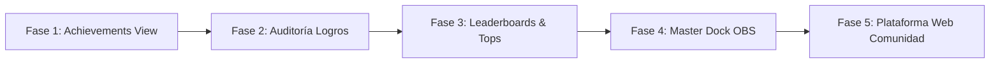

# 🗺️ ROADMAP GLOBAL - Ecosistema Overlays Mithands (Cyberpunk 2077 HUD)

Documento oficial de seguimiento para las próximas fases de desarrollo, mejoras de arquitectura y nuevas funcionalidades del ecosistema de overlays y widgets para OBS Studio.

> 💡 **Panel Interactivo Cyberpunk:** Puedes abrir [ROADMAP.html](file:///c:/Users/David/OneDrive/Desktop/Overlays-Mithands/ROADMAP.html) o ejecutar [Abrir_Roadmap.bat](file:///c:/Users/David/OneDrive/Desktop/Overlays-Mithands/Abrir_Roadmap.bat) para ver la interfaz interactiva con checkboxes, porcentaje en tiempo real, filtros y persistencia automática.

---

## 📌 Fases y Grandes Objetivos

---

### 🎛️ Fase 4 (DESTACADA): Panel Maestro de Control OBS & Gestión Integral de Widgets (Master Control Dock)
* **Objetivo:** Desarrollar una interfaz de control centralizada (Browser Dock acoplable en OBS) que permita gestionar, posicionar, calibrar y testear en tiempo real todos los widgets del canal (Chat, Meta, Seguidores, Votaciones, Logros, TTS) desde una única pantalla con estética Cyberpunk 2077.

#### 🛠️ Módulos y Capacidades del Master Dock:
1. **📍 Control de Posicionamiento y Transformación en Vivo:**
   - **Ajuste Milimétrico:** Sliders y controles para coordenadas (X, Y), escala/zoom, opacidad y capa (z-index) de cada widget.
   - **Presets de Escena Rápidos:** Perfiles preconfigurados guardables (ej. *"Modo Gaming"*, *"Modo Just Chatting"*, *"Modo Torneo"*, *"Modo Minimalista"*).
   - **Alineación Rápida:** Botones de anclaje con 1 clic (*Esquina Superior Derecha, Inferior Izquierda, Centrado*, etc.).
   - **Persistencia Automática:** Almacenamiento local de coordenadas (`localStorage`) para que todo quede fijado al reiniciar OBS.

2. **👁️ Conmutadores de Visibilidad & Estados:**
   - Interruptores individuales ON/OFF para cada widget con animaciones glitch/cyberpunk.
   - Botón de **"Limpieza de Pantalla / Modo Cinemático"** (oculta todos los widgets a la vez en momentos de alta tensión en el juego).

3. **🎯 Control Dinámico de Metas y Parámetros:**
   - Modificar la meta de seguidores/subs (ej. cambiar objetivo de 75 a 100) y títulos en vivo sin editar archivos de código ni reiniciar fuentes en OBS.
   - Forzar re-sincronización y reset de contadores al vuelo.

4. **🧪 Centro de Pruebas y Emulación Rápida (Test Hub):**
   - Botones para simular eventos en directo: Nuevo Follower, Sub, Donación, Cheer/Bits, Meta al 100%.
   - Emulación de mensajes de chat especiales, logros desbloqueados y subidas de nivel.

5. **🗣️ Consola Unificada de TTS & Audio:**
   - Control de volumen maestro, botón de silencio de emergencia (Mute All), salto de audio actual y pausa de cola.

6. **📊 Gestor de Votaciones Interactivas:**
   - Crear y lanzar encuestas/votaciones con temporizador y opciones personalizadas directamente desde el panel.

7. **⚡ Arquitectura de Comunicación de Ultra-Baja Latencia:**
   - Implementación de **`BroadcastChannel` API** + **LocalStorage Events** entre el OBS Dock y las Browser Sources para latencia 0 ms sin dependencias complejas.

8. **🔍 Revisar todas las opciones, terminar de ajustar el diseño y revisar que nada falle:**
   - Auditoría exhaustiva de todas las opciones, controles y botones del Master Dock y overlays.
   - Ajustes finales de diseño, micro-animaciones y alineaciones visuales.
   - Comprobación rigurosa de estabilidad para garantizar que ningún módulo o bus falle en stream.

---

### 🎯 Fase 1: Transición Definitiva de Logros a `Achievements-view.html`
* **Objetivo:** Desacoplar y retirar las alertas de logros del interior de la tarjeta de chat principal (`index.html`), delegando la visualización en el overlay independiente `Achievements-view.html`.
* **Acciones técnicas:**
  - Desactivar o limpiar el contenedor `#achievement-notifications` en `index.html`.
  - Configurar `NotificationManager.js` para que el chat principal no reproduzca banners de logro en su layout.

---

### 🏆 Fase 2: Auditoría y Evolución del Sistema de Logros
* **Objetivo:** Revisar la biblioteca actual de logros (`data/AchievementsData.js`) para depurar obsoletos y diseñar nuevos desafíos para la comunidad.
* **Puntos a auditar:**
  - Identificar logros obsoletos y desbalanceados.
  - Categorización: Stream / Asistencia, Participación en Chat, Juegos Activos (Cyberpunk 2077, The Witcher 3, etc.), Secretos.
  - Optimización de iconos Cyberpunk neón en `img/logros/`.

---

### 📊 Fase 3: Análisis y Rediseño del Sistema de Tops / Leaderboards
* **Objetivo:** Optimizar el cálculo, almacenamiento en GitHub Gist (`GistPersistenceService.js`) y proyección de rankings.
* **Mejoras:**
  - ✅ **Comandos de chat interactivos (Completado):** `!top` / `!topxp` (Nivel/XP), `!toplurk` / `!toptiempo` (Watch Time acumulado), `!topracha` (Rachas activas) y `!nivel @user` / `!racha @user` para consultar estadísticas propias o de compañeros.
  - ✅ **Filtro y Exclusión Global de Tops (Completado):** Exclusión de streamer (`mithands`), cuentas secundarias (`playmithttv`) y bots de todos los tops de XP, tiempo y actividad en directo.
  - **Ajustar pantallas de Top en el Widget inactivo:** Configurar la rotación del overlay para proyectar tanto el Top General de XP / Nivel como el Top Lurk claramente diferenciados.
  - Nuevos criterios de ranking (Top First Hackers, Top Rachas).
  - Resets de temporada sin perder historial acumulado.

---

### 🖥️ Fase 5: Plataforma Web de la Comunidad (Tops, Perfiles y Estadísticas)
* **Objetivo:** Portal web público e interactivo con estética Cyberpunk 2077 para que los espectadores consulten rankings, estadísticas individuales y vitrina de logros.
* **Módulos:**
  - Leaderboards y rankings en vivo.
  - Buscador de perfiles de espectadores (*Merc Dossier*).
  - Compendio interactivo de logros (*Achievement Showcase*).
  - Histórico de temporadas y torneos.
  - 🛠️ **Visor y Telemetría de Errores en Vivo (Error Logger HUD):** Monitor que captura excepciones de JavaScript, caídas de conexión con Twitch/Gist y fallos de audio para diagnóstico instantáneo.
  - 💬 **Historial y Registro de Mensajes del Chat (Chat Message History & Replay):** Visor con búsqueda para consultar mensajes anteriores, comandos ejecutados y eventos interactivos en vivo.

---

*Última actualización: Septiembre 2026 - Versión 2.8*
